# IBM IT Architect Assistant User Guide v2.1
**IBM IT Architect Assistant** (Architect Assistant) is a simple web-based tool to assist an Architect in designing a solution by finding the best/relevant/potential architectural solutions and/or patterns and customizing them for specific needs.

At its core, **Architect Assistant** is both a solution model authoring tool as well as a searchable repository of authored solution architectures/models.

The Documentation is organized in the following sections:
- [Terminology](#terminology)  
- [Getting Started](#getting-started) 
- [Major sections: Workspace and Search](#workspace-search-and-dashboard)
- [Search](#search) 
- [Architecture Cards](#architecture-card-elements)  
- [Workspace Details](#workspace---private-collaboration-and-bookmarks)
- [Basic authoring of architecture artifacts](#authoring)
- [Import and Export](#import-and-export)
- [Interactive Guidance - Archie](#archie-chatbot)  
- [Detailed authoring - by artifact type](../../master/docs/Artifact-Details-1.1.md) 
 

## Terminology
Before diving into details about Architect Assistant it is important to understand some key terminology used throughout the documentation.  

**Logical Asset Repositories** -- Today there are 3 logical repositories of architectures: **Public**, this contains curated, read-only architectures that can be discovered via search; **Private**, every user has a set of private assets that they own, that by default are read-write and not discoverable by other users; **As-Is**, any private asset can be set as discoverable (marked As-Is) by the owner. As-Is assets are searchable and anyone following the link to an As-Is asset will be added as a "Viewer" collaborator.  
  
**Collaboration Roles** -- All architectures have an **owner**. For private (and thus also As-Is) architectures there can be a set of collaborators. A collaborator is a user that has a set of permissions for the architecture. The roles are:  
- **Viewer** -- has read-only access to the architecture  
- **Editor** -- can make changes to any content of the architecture  
- **Admin** -- is an editor that can also change the role of any collaborator.  
- **Owner** -- is the only user that can delete the architecture.  
An owner can explicitly "invite" collaborators and assign corresponding role to each. There also is the ability to create and manage groups of users for purpose of collaboration. (Note for all **Public** assets, all users are implicitly **Viewers** and no one is an Editor or Admin).  

**Artifact** -- An architecture (asset) is comprised of a set of artifacts that are typed. The standard set of artifacts are displayed in the architecture's Table of Contents (**TOC**). Many of the artifact types can have 0 to n **artifact instances**.  Examples of artifacts include Business Challenge, System Context, Functional Requirement, etc.  Most of the artifacts correspond to a technical work product.

**Shared Elements** -- The building blocks of an architecture are a set of architectural elements. Each of these elements have a specific type along with a set of attributes. Many of the architecture elements contribute to and are referenced within multiple artifacts and artifact instances. As such it is important that these elements are shared (i.e., by reference). The implication is that each shared element must have a unique name within the architecture. To enforce this constraint the tool will flag as an error anytime a new element is created and given a name already in use in the architecture.  This error forces the user to either bind to (reference) the currently existing shared element or if the user needs to reference a different architecture element, supply the new element with a unique name. For example, adding a new Logical Node to an AOD IT System View instance and giving it the name **Security Services** when a Logical Node with that name already exists (perhaps on a different diagram instance) results in an error (duplicate name error). To resolve this the user can click on the **Select from existing** button and point to the existing Logical Node, indicating you are reusing the same element. Alternatively a different (unique) name can be assigned. Either approach will remove the error.

([Back to Top and TOC](#ibm-it-architect-assistant-user-guide-v2.1))
 

## Getting Started
  
Getting started with Architect Assistant depends on your usage intent. The most common usage intents are:  
- Search for and review an existing and accessible architecture. This scenario may be to support an architect understanding about what assets are available and/or specific details about any particular architecture.  
- Author a new or existing architecture.  

In each case the fundamental construct is an architecture. An architecture is comprised of a set of interrelated artifacts many of which share a set of elemental architecture building blocks (or elements). The best way to visualize this structure is through Architect Assistant's Table of Contents for any architecture.

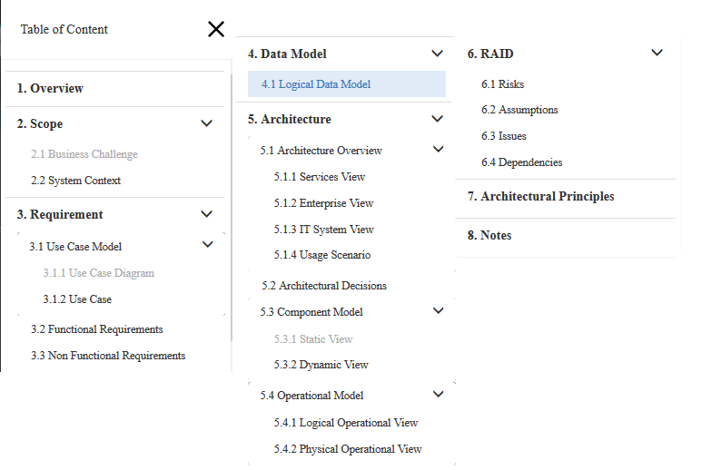

This standard structure directly supports the details of a specific solution architecture, but can also be used to manage a set architecture building blocks which are described as a **architecture pattern** within the tool.  This may be a library of reusable standard *parts* or a more integrated set of reusable content.  These *architecture patterns* typical get used as a source resource for copying a subset of the pattern asset into a target architecture.  This is useful to be able to consistently use these building blocks in multiple architecture

An architecture is what is addressable via search, can be edited, copied or deleted. In Architect Assistant, an architecture can be selected via a **card** that will appear in either your workspace or in the search area. 

## Workspace, Search, and [Dashboard]
When a user logs into Architect Assistant they are presented with two (2) or potentially three (3) tabs.  
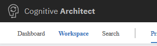

The two primary tabs (sections) of the tool are **Workspace** and **Search**. **Search** is used to discover existing assets found in the Public and As-Is repositories. **Workspace** is where a user has access to a specific set of architectures. If a user is the owner of 1 or more architectures that are discoverable via search, then the **Dashboard** tab will be available.  The Dashboard provides information about who has made copies of the user's "published" architectures. 

([Back to Top and TOC](#ibm-it-architect-assistant-user-guide-v2.1))

### Search
When a user navigates to the Search page, they are presented with the **top trending public assets** along with a search bar.  

  

Currently the search is made against a set of keywords and tags as well as the text of the Title of the architecture.  Each architecture can have a set of tags associated with them. These include the applicable **Industry(ies), Technology(ies), and Tags**.  In the above image, it can be seen that the tags are displayed on the architecture **card**. The corresponding search terms can be typed into the search text box and/or can be selected from the Catalog.

The architectures returned in a search result set are either **public, readonly (curated)** assets or are **private, As-Is** assets. 

### As-Is
Any user of the system can choose to have a private architecture that they own, discoverable via search. This property is enabled/disabled via the architecture information page.  The information page is accessible via the info toolbar button of an open architecture. This architecture information page is where an asset owner can change the architecture name and other attributes such as client, opportunity number, tags, etc.

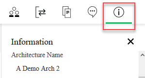

If you are the architecture's owner and you currently have edit control on the architecture, the **Share As-Is** slider control is enabled to turn **On** or **Off**.  When on, there is a "shareable" URL available for copy.

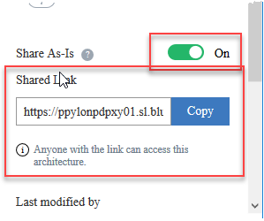

This shareable link has a special format. The URL will be of the form &lt;Architect Assistant server&gt;/architectures/**Social**/...  When a URL of this form is used to access the identified architecture, two actions occur prior to redirecting to a URL where **Social** is replaced by **Collaboration**.  First a check is made to see if the target architecture still has "As-Is" property enabled. If not, the URL is rejected. If the architecture does have "As-Is" property enabled, a check is made to see if the logged in user is currently a "collaborator" for the target architecture and if not, they are added as a *Viewer* on the architecture's collaboration team. Then the URL is rewritten and forwarded, resulting in opening the architecture from the user's Collaboration Workspace tab.

Any architecture returned via search will have a minimum of "Viewer" access for all users. Thus the architecture card's additional menu will 
include **Copy**.  This permits the user to create a complete copy of the architecture by supplying a new unique name for the resulting Copy.

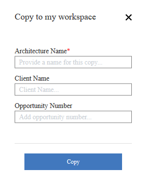

This is a fundamental operation to support rapid reuse of an asset. Once you have created a personal copy it can then be tailored to meet your needs. Many of the public, curated architectures are Reference Architectures or Reference Solutions, ideal for tailoring and generating a specific solution architecture. See the how-to video on [Locating and Reusing assets](http://w3.tap.ibm.com/medialibrary/media_view?id=414754) for a demonstration.

### Search Filters

The result of a search produces a set of cards for the architectures matching the search keywords. There are a set of filters available to select a subset of the returned search result. These include filtering between showing curated vs. As-Is architectures. It also includes selection of asset type (Solution Architecture, Reference Architecture or Architecture Pattern).

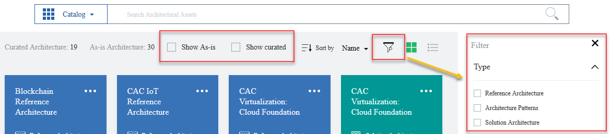

([Back to Top and TOC](#ibm-it-architect-assistant-user-guide-v2.1))

### Architecture Card Elements

In all contexts an Architecture card has many of the same elements displayed. The architecture name is prominent on the top left with an "additional menu" identified via the ellipses **...** in the upper right corner. The color of the top half of the card along with the text and icon at the bottom of the colored section identify the type of asset. In the bottom half of the card (when you are not hovering over it), you will see a set of optional tags. And at the bottom you may see 0-2 *metrics* displayed, depending on context and whether or not the architecture is As-Is or a public curated architecture.

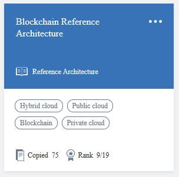

In the card above, you see a public *reference architecture*. As such there are two displayed metrics. The first, *copied* will be associated with both public assets and As-Is assets. It shows the number of unique copies that have been made by users. The second metric, *Rank*, is unique to public assets. Rank is computed daily and rank orders all public assets based on the number of copied made during the past 30 days. So in the example, 9/19 indicates this architecture had the 9th most number of copies made in the past 30 days when comparing all 19 public assets. Non-searchable architectures will not have any metrics computed or displayed on the corresponding architecture card.

When you hover over an architecture card, the display changes.

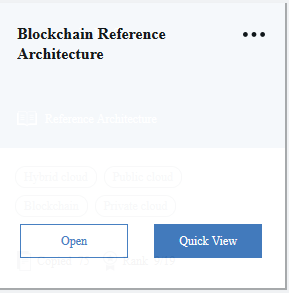

The display will provide the architecture name and then two buttons, **Open** and **Quick View**. Clicking on **Quick View** opens up a summary panel on the right side of the browser. This quick view will include Type, Name, Tags, the Overview text and a list of the populated Artifacts.  If this is a private asset, the information about the owner will also be displayed.  The bottom of this Quick View is the **View Detail** button which performs the same operation as the **Open** button on the main card.

Clicking on **Open** will then open the architecture, displaying the Table of Contents (TOC) on the left side and the details of the selected artifact (selected in the TOC) in the main section. By default, the asset opens to the **Overview** artifact. When you open an architecture, you may open it in View mode (readonly) or in Edit mode. Opening in Edit mode at a minimum requires being an Editor or Owner of the corresponding Architecture, but may also require having the **pen**, i.e., the edit rights, if the architecture has multiple editors specified. There is a short how-to video that demonstrates working with the [Architecture/Asset card](http://w3.tap.ibm.com/medialibrary/media_view?id=414349).

### Typical Use Case from Search

In general, if you choose to open an architecture discovered via search you will open in **View mode**. And most will use this detail viewing as an opportunity to decide how they wish to use the asset. When an architecture is open on the primary TOC view (i.e., not within an artifact instance), there are a set of toolbar buttons available on the upper right part of the display, immediately under the Workspace and Search tabs. Two of these are more commonly used while reviewing a discovered architecture. 

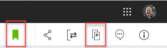

First, the bookmark button, which allows you to add a link to this architecture to your bookmarks to either locate it more quickly later or to reference the asset for fine-grained copy and paste. Second is the copy button that allows you to create your own **private read-write** copy of the complete architecture. If you choose to create a private copy, you will supply a unique architecture name and optionally provide client name, opportunity number and tags.  Once the copy has been created you will be taken to your Private Workspace view where you can then open this newly created copy.

([Back to Top and TOC](#ibm-it-architect-assistant-user-guide-v2.1))

### Workspace - Private, Collaboration, and Bookmarks

The Workspace is an area in which a set of Architectures, referenced by the user, can be located. The default workspace tab, your **Private Workspace**, maintains all architectures owned by you. These are read-write assets that will typically be associated with specific solution designs that you are working on. The default sort order is by name, you can temporarily select to sort by most recently modified. You can also filter the list of architectures visible by selecting 0 or more Client Names and 0 or more Tags. This makes it very easy to locate specific architectures within your workspace.

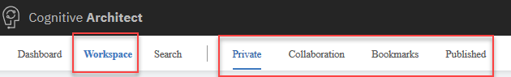

The second workspace tab is labeled **Collaboration**. Here you will find all architectures that have been shared with you. These are architectures owned by someone else and they have either explicitly shared access with you by adding you as a collaborator or they have chosen to share the architecture anonymously by marking it **As-Is**. Once you follow a link to open an As-Is architecture you are immediately added as a Viewer on that architecture. 

How you work with architectures in the Collaboration tab is dependent on the nature of the sharing. An owner may share access to an architecture to either provide you with awareness or to elicit feedback (review and/or comments). There is an explicit capability whereby you can leave comments on any architecture you have access to.  The comments are associated with an artifact type and are tagged with your email address (as comment author) along with a timestamp of when the comment was made. 

You might be given **Editor** rights to an architecture whereby you can become a co-author on the architecture, sharing a single **pen** indicating who has edit control at any point in time. Lastly, by having access (of any kind) to an architecture, provides you with the ability to create a private copy which you can then independently customize for your own purposes.

The third workspace tab is labeled **Bookmarks** and provide links to discoverable architectures that you have chosen to bookmark.  These are particularly useful to reference an asset which you will use to copy from. Generally you will be copying a small portion of the architecture, e.g. as an interaction pattern from one of its diagrams.

Back on the private workspace where you find the set of architectures you own, there are a set of options available to you on the "more" **...** menu. Always available on all architectures everywhere is **Copy**.  This requests a new copy of the architecture to be created, owned by the invoker. Scenarios for copying include implicit versioning or starting a new project with an initial starting point. In addition, as an owner of an asset you will have the ability to select **Delete** off of the same menu. Finally, in the current release, if you are and editor or owner of an asset and there are at least 2 editors, then this menu will have an item to control access to edit privileges. The menu will either contain **Get pen** or if you already are the designated editor (holder of the pen) the menu item will be **Return pen** whereby you can relinquish editing control.

([Back to Top and TOC](#ibm-it-architect-assistant-user-guide-v2.1))

## Authoring

If you have edit control, when you open the architecture you will be able to author any of the contained artifacts.  Earlier we showed the standard TOC for an architecture. Let's classify the individual artifacts to help setup common user experience for authoring. First, there are artifacts that have exactly one instance and thus edit them directly and another set of artifacts in which you will edit individual artifact instances. The Overview, Business Challenge, and System Context each only have a single instance. So when selecting these artifacts in the TOC, the directly editable content appear on the right side with the ability to **save** your changes. Both the Overview and Business Challenge are rich text based artifacts, so the "editor" is a lightweight rich text enabled text box. The System Context is a diagram and thus the editor is the tool's MxGraph-based diagram editor. All other artifacts support multiple instances, so selecting such an artifact (for example Functional Requirements) will lead to the right side being a list (card style) of the currently existing instances plus a card-like control (**Plus sign**) that you can click on to create a new instance.

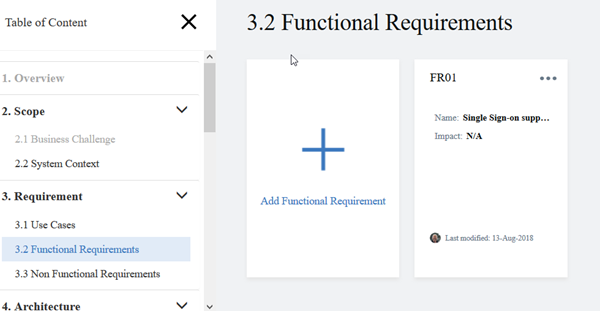

Clicking on the Add instance button will prompt for the minimal set of properties to uniquely define the instance (usually just name, but sometimes also an id). From a basic user experience perspective, there are four types of artifacts and therefore artifact instance types: 1) Form-based text artifacts, 2) Free form text artifacts, 3) Diagram artifacts, and 4) a diagram overlay artifact. 

### Form-based text artifact types
The first type includes: Use Cases, Functional Requirements, Non-Functional Requirements, Architecture Decisions, Architecture Principles, Risk, Assumptions, Issues, and Dependencies.  These typically would be viewed outside the tool as tables each with a very specific structure (attributes) based on the information represented by the artifact type where each row (or record) corresponds to a single artifact instance. Since the editor is form-based, you will have individual fields (attributes) editable by their own UI control.  In some cases, an attribute value may be a reference to an architectural element, typically presented via a drop-down list.

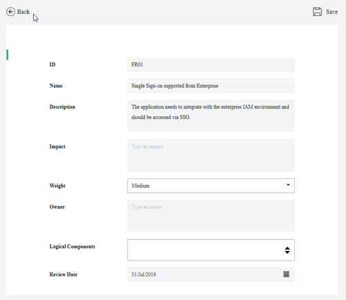

### Free form text artifacts
The second type of artifact from a UI perspective includes **Notes**. Notes are intended to easily allow any miscellaneous content to be attached or associated with an architecture that otherwise doesn't have a structured artifact prescribed. Each Note is a standalone entity which includes Rich Text (including embedded images) along with file attachments. Here the editor is a specialized rich text editor. There is an option to create (manage) a set of labels or tags that can then be added to Notes. The visible Note instances can then be filtered based on the applied labels.

### Diagrams
The third type of artifact provides the richest user experience. These are specialized diagram types all of which are delivered by a custom *MxGraph-based* diagram editor. MxGraph is an open source framework that delivers client side JavaScript diagramming capabilities.

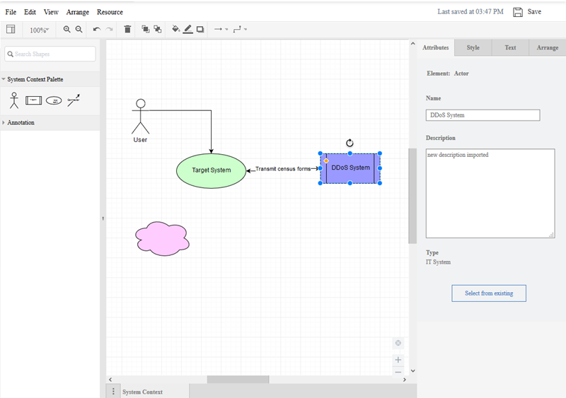

Above is a System Context diagram in Architect Assistant. Let's look at the various parts of the editor. 

The top two rows include the menu and toolbar controls.  These are only present when the diagram is open in edit mode. If you are just viewing a diagram, these elements won't appear on screen (including the explicit save button). 

Next on the left hand side you will find a set of drawing palettes. These supply the elements that can be added to the drawing canvas (the main part of the editor and where the diagram resides). In Architect Assistant, the top most palette will have a name that specifies the type of diagram, and includes all of the *architectural elements *that can be added to the diagram.  In this case the **System Context Palette** includes a Human Actor symbol, an IT System Actor symbol, a Target System symbol and a Connector symbol. Each of these symbols, when added to the diagram, will be associated with an architecture element (core model element) each of which have an associated set of attributes dependent on the element type. 

The attributes for a model element appear within the Attribute tab of the **format panel** typically visible to the right of the diagram (canvas).  For example, in the diagram above you see the purple IT System symbol, named DDoS System, selected. Since the selected item represents an architectural element, there is an Attributes tab on the format panel that displays the attributes of the associated architectural element. In this case the type of architectural element is an **Actor** with Name, *DDoS System*; Description, "*new description imported*"; and a Type of *IT System*.

In addition to the diagram specific palette, there will always be an *Annotation* palette.  This palette contains a set of common shapes. Adding a symbol from the annotation palette onto the diagram just adds that shape to the diagram. This shape is NOT associated with any architectural element.  Thus annotations are just used to add style to the diagram.

Below is the same System Context diagram, with the pink cloud shape selected. Note that the format panel only shows the Style, Text and Arrange tabs; the Attributes tab is missing.

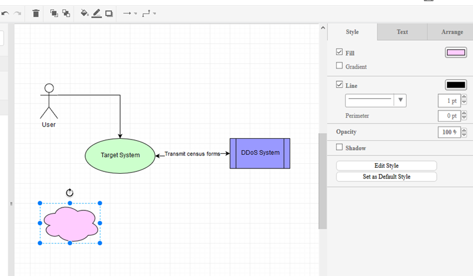

A few diagram types have additional palettes available beyond the diagram specific palette and the annotation palette. Those will be detailed in sections specific to those diagram types.

In general you add something from a palette onto the drawing canvas via a drag operation. Select a symbol and drag from the palette to where you want to place it on the canvas. If you just click on a symbol, the symbol will get added at a random location on the canvas. All non-line/connector symbols have a "bounding box" which includes anchor points where connections can be made by the endpoint of a line/connector symbol. When connecting the end of a connector to a symbol you will want to see a "green" connection dot or green bounding box outline appear before releasing the mouse to make the connection. Otherwise, you will have just moved the line's endpoint without accomplishing making a connection.

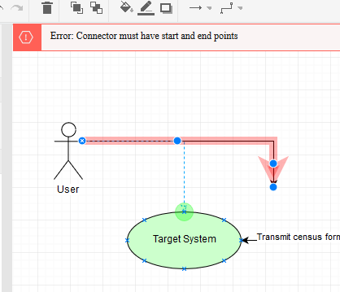

The start state for the above graphic is a connector (highlighted in red along with error message) whose one endpoint is not connected. The arrow head end has been grabbed using the mouse and the mouse moves over the edge of the target system. When positioned properly, you see the anchor points (the tiny blue 'x's), and the "hot green dot" shows a selected anchor is active. Releasing the mouse will make the connection (as per earlier version of the diagram) and the error will be removed.

#### Quick Connect
In the case of the System Context diagram (and many more of the diagram types), there is exactly one type of connector supported on the diagram. In these cases it is not necessary to explicitly drag the connector from the palette onto the canvas and then connect each end. Instead, with nothing selected on the diagram, hover the mouse over the bounding box for a symbol you which to have as the starting point for a connector. Once you get the green outline or green circle, click the mouse and then move over the boundary of the destination symbol. Once you get the destination symbol (outline or circle) to turn green, release the mouse.  This will add the connector while connecting it at the same time. You might have access to a short video on [basic diagramming](http://w3.tap.ibm.com/medialibrary/media_view?id=414464) which provides a quick demo on these techniques.

#### Style and more
The MxGraph framework provides a rich set of formatting tools to help you make the diagram look however you would like. Many of these are self explanatory and are available directly in the 3 separate tabs of the **format panel**: Style, Text, and Arrange.  

The Style panel let's you apply style to whatever element is selected.  So if it is a line, the choice of line style (dash, solid), endpoint style (arrow type), thickness, color, etc.  You can also adjust whether the line is straight, curved, orthogonal jogs, etc.  Also if two lines are selected (which cross), you can set the style for the line crossing.  If the symbol is a shape then things like fill and outline color, etc are available to be changed. 

The style panel also includes an Edit Style button which provides access to the basic properties of the shape for instance the base shape type, whether it is a container, whether the shape is represented by an image (icon) - thus exposing an "edit image" control, etc. Knowledge of the "Edit Style" and the corresponding style commands are most important to be able to replace the style of one symbol with the basic style of some other symbol in the system. 

**Tip:** For instance, you might want to have your Target System represented by an image in the System Context diagram. One way to do this is copy the style from a Logical Node from an AOD IT System View and paste that into the Style for the Target System and then edit its image. This approach of identifying and applying a style from a symbol from any diagram to a different symbol in the same or different diagram type can universally be applied. This technique is demonstrated in the [applying styles to graphic elements how-to video.](http://w3.tap.ibm.com/medialibrary/media_view?id=420960)

The Text panel let's you modify the text properties for the selected item.  This includes things like positional alignment (vertical and horizontal), font family and size, bold, italics, and underline, word wrap, font color and background color.

The Arrange panel allows you to position the layering of stacked items (to front, to back), the size of symbols and the position relative to the canvas, and flip and rotate symbols. Of perhaps most value is being able to select multiple symbols and align and space them.

#### Undo, Save, and Auto-save
Architect Assistant is a single page application (written in Angular). In this environment all of your edit operations are being handled within the Browser via the MxGraph javascript library. As you make changes, MxGraph is managing a "stack" of changes you make allowing you to "undo".  At the same time, nothing is being persisted to the back-end until a "Save" is performed.   Thus, if you were to make several changes and then close your Browser your update work will be lost. The Save button, in the upper right corner of the MxGraph editor, will write-back the current state of the diagram (and underlying architecture model) to the back-end for saving. 

When a diagram is saved, the undo "stack" is cleared. Thus, undo is only available between "saves". In addition to the explicit save, Architect Assistant will "auto-save" your diagram every 10 minutes.

#### Model validation rules and Auto-save
Each diagram type has a set of validation rules associated with it to help maintain a valid architecture data model.  For example, a System Context diagram, must have 1 and exactly 1 Target System present on the diagram. In addition, all connectors must have 1 endpoint connected to the Target System and the other endpoint connected to an Actor. In other words, connectors are not allowed to connect two Actors together. Also while editing this diagram, there are some architecture-wide validation that is also being enforced, e.g., each of the Actors and Target system must be unique (unique name) within the Architecture.  Attempting to name a symbol/element with a name that already exists will generate an error. In the case of the System Context diagram, all of this validation can (and is) performed by the front-end logic, i.e., the UI. In other diagram types, there are some validation rules that can only be fully assessed by the back-end during a "save" operation. The user experience of these types of validation checks, is that you won't see the validation error message until the save happens. This is particularly odd for the user when the application "auto-saves". In this case you might not be actively doing anything in the editor, auto-save occurs, and the back-end detects a validation error and you likely get a "save failed" along with the validation error.

**Tip**: When starting to work on a new diagram type, you are advised to explicitly save after any noteworthy change to the diagram so that you can better understand any back-end validation errors that may get triggered.

#### Diagram level attributes
In any diagram in Architect Assistant, with no symbol selected, the Attributes panel will present the attributes of the diagram itself.  This is where you will see the diagram name, a diagram description (which is where you can document the intent of the diagram), and potentially one or more diagram level view controls.  One common view control is turning on/off displaying of connection names on the diagram.

### Diagram Overlay artifacts
The fourth artifact type from a user experience basis is a diagram overlay, **Usage Scenario**. The usage scenario provides a way to overlay a "story" or "flow" onto an existing Architecture Overview diagram. What is uniquely authored in a Usage Scenario instance, is this story. When a new instances is created, you must first specify the AOD diagram it is based upon (selected from a list) along with the scenario name.

In the editor for a usage scenario, there are no drawing palettes. Instead you are provided with a way to select a "connector" from the underlying AOD diagram and then associate it with one or more *steps*. A step has two attributes, name and description. Further the name must be a single token and either be all numeric or all alphabetic. (The idea is the steps have names: 1, 2, 3, ... or A, B, C, ...).  The description is used to tell the "story segment" associated with the step. When a "connector" is selected, all currently defined steps for the usage scenario are presented along with a checkbox to select or deselect each one. The usage scenario editor will place "step circles" on the selected connector for each associated step. When given the option to select the associated steps, you are also presented with the ability to create a new step.

In addition to adding and associating steps to connectors, you can also select any other (non-connector) symbols and "disable" them.  The editor then will "gray-out" these disabled symbols.

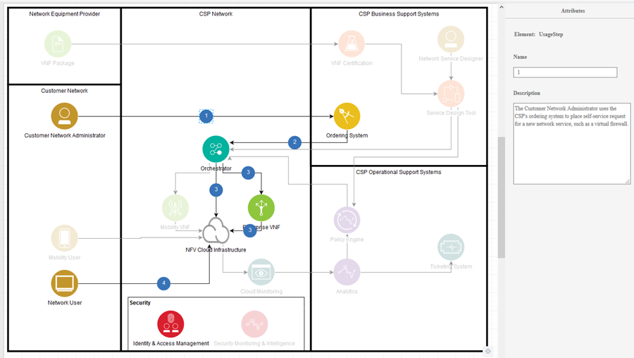

([Back to Top and TOC](#ibm-it-architect-assistant-user-guide-v2.1))

## Breadcrumbs and Navigation

Navigation within the tool is managed in several ways. From a top-level landing pages you have the two-level navigation tabs presented as seen here.

Within an architecture there are two different navigation mechanisms depending on if you are within an artifact instance. When you are not within an artifact instance, the TOC provides the way to select an artifact type to view or edit. In or out of an artifact instance, there is a "breadcrumb" that supports navigation to all levels of the tool. If a particular level of a breadcrumb represents multiple options at that level, there is a "down arrow" that will present you with the available elements at that level to select and navigate to.

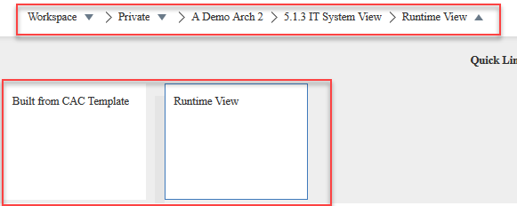

## Import and Export
There is a lot of value of having everything associated with a Solution Architecture captured within a single asset that can easily be shared with collaborators. However there are many situations in which an architect would like to deliver a snapshot of the architecture in a different format, not requiring either the online or offline tool. Architect Assistant provides a set of import and export utilities to address these needs. Let's first take a look at the rich set of Export Utilities available. 

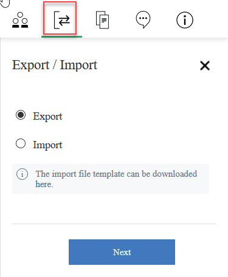

Above you see the toolbar button to access the import and export utilities. First you select if you want to export or import.  Note there is also a link to an *import template* file to download and modify in order to be able to import from an Excel spreadsheet. Selecting Export and clicking Next will take you to a dialog where you can choose the type of export. There are three* choices presented:
- **Microsoft PowerPoint** - This produces a summary PPTX document containing the major sections of the architecture. This is a good way to quickly get content out in this format to share with others.  Clicking Next will generate the file and then prompt you with a Browser open/save dialog.
- **Microsoft Excel** - This produces a multi-worksheet Excel document (XLSX) that include everything in the model with the exception of the diagram images. In reality, when you click next you are presented with a pick list of "reports" to be included in the export.  There are three groupings of reports, Architectural elements (the key reusable elements in the model), Text-based artifact reports (FRs, NFRs, ...), and Diagram-based artifacts that describe content that appears on each diagram.
- **Microsoft Word** - Today this produces a standard all inclusive Word document.  In the future you will likely be able to select among a set of document templates.
 
If you choose Import you are presented with one* choice:
- **Microsoft Excel** - This expects the import file to conform to a standard import template that you can download via the link. This import only supports the first two report groups from the Excel export utility. This allows you to add or modify shared architectural elements and well as all of the text-based artifacts.  This is a great way to manage working with FRs, NFRs, Use Cases, Architecture Decisions, etc. as spreadsheet data and import / update in a timely manner. 

The template includes a worksheet for each architecture element or artifact instance type. Here there are columns for all attributes of the items to be imported. There is also an extra column, *Previous Name* that can be optional used to indicate you wish to change the name of an existing element.

Import by default supports *Add*, *Update*, and *Rename*. The parser checks the "Name" and "Previous Name" columns. Typically the Previous Name entry will be blank, in which case if a row name matches an existing element, all attributes are overwritten with the values found in the import spreadsheet. If name  does not match any existing elements, a new element is created. If Previous Name matches an existing element then that element is renamed and updated.

In the future, expect to see additional functionality added to the existing import/export utilities including support for other external formats.

([Back to Top and TOC](#ibm-it-architect-assistant-user-guide-v2.1))
